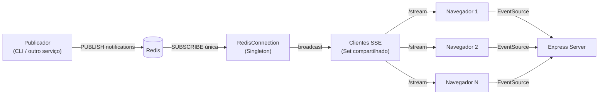

# SSE + Redis — Notificações em tempo real

Aplicação de demonstração que entrega notificações em tempo real ao navegador usando **Server-Sent Events (SSE)** no backend e **Redis Pub/Sub** como barramento de mensagens.

O frontend React escuta o stream SSE e exibe um histórico de notificações conforme elas chegam. Qualquer serviço (ou comando manual) pode publicar mensagens no Redis e todos os clientes conectados recebem a atualização instantaneamente.

---


## Visão geral


> **Print:** interface web com badge de conexão e painel de histórico de notificações.

| Componente | Tecnologia | Porta |
|------------|------------|-------|
| Frontend   | React + Vite + TypeScript | `5173` |
| Backend    | Express + TypeScript | `3000` |
| Mensageria | Redis (Pub/Sub) | `6379` |

---

## Arquitetura



1. Um publicador envia uma mensagem ao canal `notifications` no Redis.
2. A instância única de `RedisConnection` (Singleton) recebe a mensagem via Pub/Sub.
3. O servidor repassa a mensagem a **todos** os clientes SSE conectados — sem abrir uma conexão Redis por usuário.
4. O frontend recebe o evento `notification` e atualiza o histórico na tela.

### Padrão Singleton (`RedisConnection`)

O backend usa o padrão **Singleton** para garantir uma única instância de conexão com o Redis compartilhada por toda a aplicação:

| Recurso | Instâncias | Uso |
|---------|------------|-----|
| `RedisConnection` | **1** (Singleton) | Ponto central de acesso ao Redis |
| Cliente de comandos | **1** | `PING` no `/health` e operações gerais |
| Cliente subscriber | **1** | Inscrição no canal `notifications` |
| Conexões SSE (`/stream`) | **N** (uma por navegador) | Apenas HTTP/SSE — **não** abrem conexão Redis |

O Redis exige conexões separadas para comandos e Pub/Sub, mas ambas são criadas **uma única vez** dentro do Singleton e reutilizadas por todos os usuários conectados.

```typescript
// Uso em qualquer parte do servidor
const redisConnection = RedisConnection.getInstance();
const redis = redisConnection.getClient();       // comandos
const subscriber = redisConnection.getSubscriber(); // pub/sub
```

Ao encerrar o processo (`SIGINT` / `SIGTERM`), `disconnect()` fecha as conexões e libera a instância.


> **Print:** diagrama ou captura ilustrando o fluxo Redis → Server → Browser (opcional).

---

## Stack

- **Backend:** Node.js, Express 5, ioredis, TypeScript, tsx
- **Frontend:** React 19, Vite 7, TypeScript
- **Infra:** Docker Compose, Redis Alpine
- **Padrões:** Singleton (`RedisConnection`) para conexão Redis compartilhada

---

## Pré-requisitos

- [Docker](https://docs.docker.com/get-docker/) e [Docker Compose](https://docs.docker.com/compose/)
- Ou, para rodar localmente: Node.js 22+ e Redis em execução

---

## Como executar

### Com Docker (recomendado)

Na raiz do projeto:

```bash
docker compose up --build
```

Serviços disponíveis:

| URL | Descrição |
|-----|-----------|
| http://localhost:5173 | Frontend |
| http://localhost:3000 | API / SSE |
| http://localhost:3000/health | Health check |
| localhost:6379 | Redis |


> **Print:** terminal com `docker compose up` e os três serviços (`sse-server`, `sse-web`, `sse-redis`) rodando.

---

### Sem Docker (desenvolvimento local)

**1. Redis**

```bash
docker run -d --name redis -p 6379:6379 redis:alpine
```

**2. Backend**

```bash
cd server
npm install
npm start
```

**3. Frontend**

```bash
cd web
npm install
npm run dev
```

---

## Testando as notificações

Com a aplicação aberta em http://localhost:5173, publique uma mensagem no Redis:

```bash
docker exec -it sse-redis redis-cli PUBLISH notifications '{"message":"Olá, mundo!"}'
```

O payload pode ser JSON (com campo `message`) ou texto simples. A notificação deve aparecer no histórico em tempo real.


> **Print:** tela do frontend exibindo uma ou mais notificações após o `PUBLISH`.


> **Print:** terminal executando o `redis-cli PUBLISH` e a resposta com o número de assinantes.

---

## Endpoints da API

### `GET /health`

Verifica se o servidor e o Redis estão acessíveis.

```json
{
  "status": "OK",
  "redis": "connected"
}
```

### `GET /stream`

Stream SSE. Mantém a conexão aberta e envia:

- comentários de keep-alive (`: ping`) a cada 15 segundos;
- eventos `notification` quando há mensagem no canal Redis.

Formato do evento:

```
event: notification
data: {"message":"Sua mensagem aqui"}
```

---

## Variáveis de ambiente

### Server

| Variável | Padrão | Descrição |
|----------|--------|-----------|
| `PORT` | `3000` | Porta do servidor |
| `CORS_ORIGIN` | `http://localhost:5173` | Origem permitida no CORS |
| `REDIS_URL` | — | URL completa do Redis (ex.: `redis://redis:6379`) |
| `REDIS_HOST` | `localhost` | Host do Redis (se `REDIS_URL` não estiver definida) |
| `REDIS_PORT` | `6379` | Porta do Redis |
| `REDIS_PASSWORD` | — | Senha do Redis (opcional) |
| `REDIS_DB` | `0` | Índice do banco Redis |

### Web

| Variável | Padrão | Descrição |
|----------|--------|-----------|
| `VITE_API_URL` | `http://localhost:3000` | URL base da API para o `EventSource` |

---

## Estrutura do projeto

```
sse_teste/
├── docker-compose.yml          # Orquestração dos serviços
├── server/                     # API Express + SSE
│   └── src/
│       ├── app.ts              # Rotas, SSE e broadcast
│       └── redis/
│           └── RedisConnection.ts  # Singleton de conexão Redis
├── web/                        # Frontend React
│   └── src/App.tsx
└── docs/
    └── screenshots/            # Prints para este README
```

---

## Status da conexão SSE

O frontend exibe um badge **Conectado** / **Desconectado** conforme o estado do `EventSource`. Com o servidor parado ou indisponível, o badge fica vermelho.


> **Print:** badge verde "Conectado" com histórico vazio ou com mensagens.


> **Print:** badge vermelho "Desconectado" (servidor ou Redis fora do ar).

---

## Scripts úteis

| Comando | Onde | Descrição |
|---------|------|-----------|
| `npm start` | `server/` | Sobe o backend com hot reload (tsx) |
| `npm run dev` | `web/` | Sobe o Vite em modo desenvolvimento |
| `npm run build` | `web/` | Build de produção do frontend |
| `npm run lint` | `server/`, `web/` | Executa o ESLint |

---

## Licença

ISC
